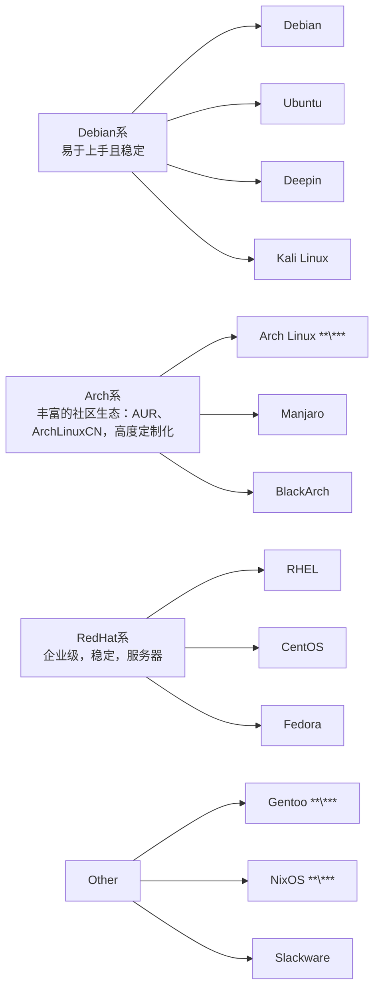
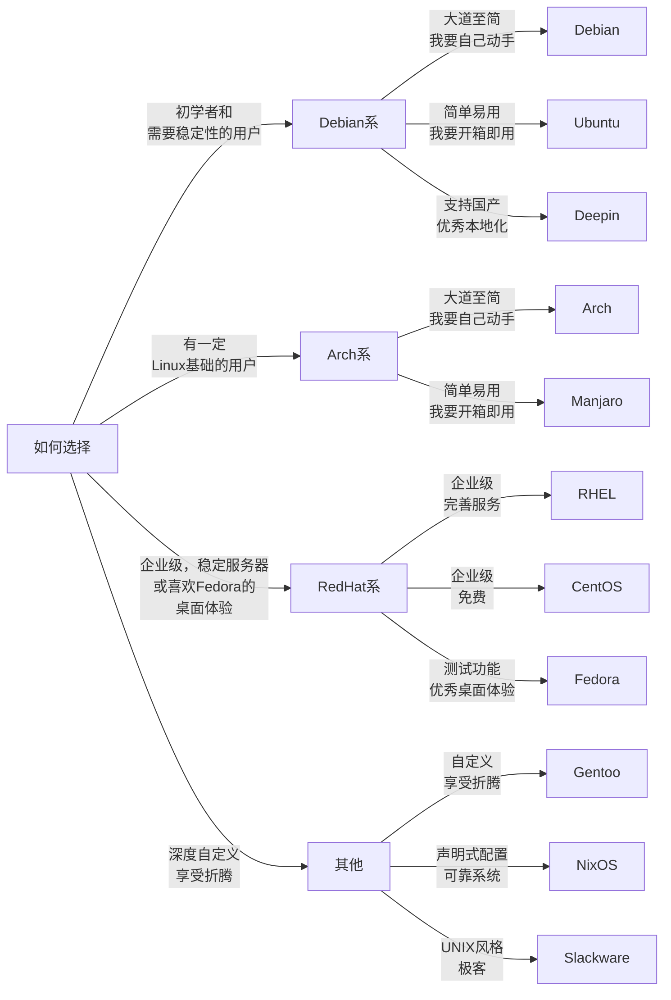

## 前言

### 岚的声明
本文为**岚**的**折腾日记**，它只是因为我**想**而写下的，**不具备**权威性，我也**无法**保证正确，**仅供参考**

### 参考资料
- [英文wikipedia](https://en.wikipedia.org/)
- [对应发行版Wiki]()

### Linux是什么
操作系统是计算机硬件和软件之间的桥梁，它负责管理计算机的资源，处理用户的输入，并输出结果。而Linux，就是众多操作系统中的一个。
**Linux内核**经由**Linus Benedict Torvalds**之手发布了最早到版本，也就是我们常说的**Linux之父**，他在1991年发布了Linux内核的第一个版本 **（没错，严格来说Linux实际上指操作系统内核）**，而 **完整的操作系统包含 *Linux内核* *GNU工具链* 以及 *X Window等其他组件***。**GNU**起源于**Richard Matthew Stallman**发起的**GNU计划**，目标是创建一个完全自由的操作系统。**自由软件基金会**将 **GNU工具链与Linux内核**的组合命名为 **GNU/Linux**，但由于**Linux不属于GNU** 计划的一部分，因此**GNU/Linux**这一命名也没有获得社区的一致认可。不过，现在人们通常将**Linux**直接用于指代完整操作系统。**本文将遵循大多数人的习惯，使用Linux一词来指代基于Linux内核的完整操作系统（即Linux发行版）。**

> 小知识：**GNU** 计划中的“GNU”是 **“GNU's Not Unix!”** 的缩写，意为 **“GNU不是Unix”**；开源协议 **GPL——GNU General Public License** 也来自这里，意为 **“GNU通用公共许可证”**。
得益于 **Linux** 开源的特性，其得到了广泛的传播和应用。从桌面操作系统到服务器操作系统，从嵌入式系统到移动设备，**Linux** 都在其中发挥着重要作用。例如你手头的安卓手机，就是基于 **Linux** 内核的操作系统；而 **Linux** 的另一个重要应用领域是服务器，如 **RHEL、CentOS**。许多大型网站和互联网公司都使用 **Linux** 作为其服务器操作系统，因为它的稳定性和安全性都得到了广泛的认可。对于个人用户，也诞生了许多 **Linux** 发行版，如 **Ubuntu、Fedora、Debian** 等，它们提供了丰富的实用工具和易于使用的界面，使得 **Linux** 操作系统更加易于使用。

### Why Linux?
- **自由**：**Linux** 是开源的，你可以**在GPL许可范围内自由地修改和分发它**。这意味着你可以随心定制 **Linux**，而不必担心受到供应商的限制。
- **稳定**：**Linux**以其 **稳定性** 和 **可靠性** 而闻名。它被广泛应用于服务器和嵌入式系统。
- **性能**：得益于开源的特性，**Linux** 社区百花齐放，各种优化和改进层出不穷，加上其可用多种高性能文件系统(**btrfs、ext4、XFS**等)，使得 **Linux** 在**性能**上有着不俗的表现。

### 一些注意事项
- **Linux**在 **开发、服务器、桌面、日常工作等** 用途都有不错的表现，但其 **并不适用Windows生态**，在Linux下运行Windows软件要额外的 **兼容层**，如 **Wine**，虽然有关技术已得到巨大进步（如 **SteamOS** 在游戏方面有着不俗表现），但 **稳定性问题** 和 **性能损耗** 仍不可避免。
- **Linux**即便有 **Wine**，也并 **不推荐作为Windows软件开发环境**，Windows仍是 **开发Windows软件的首选**，而Linux下需要 **交叉编译环境**。

  > 给开发者的小建议：**Windows+WSL**或者**Windows/Linux双系统**，是不错的选择。

- **Linux**需要一定的**耐心**，在**不断试错**的过程中DIY你自己的Linux系统。
- **Linux**的**社区资源丰富**，遇到问题可以尝试**搜索**，或者加入社区，**寻求帮助**。
- 使用**Linux**，就不能怕麻烦，虽然**Linux**的安装过程日渐趋于简单，但接下来的**使用、维护、升级等**，都需要用户具备一定的**技术知识**。如果你对Linux感兴趣，那么本文（指南第一部分）将带你了解**Linux发行版**，以及如何选择适合自己的**Linux发行版**。

## Linux发行版
目前**Linux发行版**主要分为三大分支以及一些自成一派的发行版，下图展示了**Linux发行版家族**的分类以及**部分代表发行版**，**\*** 指**通常没有官方提供的交互式安装程序**：

### Debian系
经典的发行版，以**稳定性**著称，适合**初学者和需要稳定性**的用户。**Debian**是Linux发行版的鼻祖，拥有**较长的历史和最广泛**的社区支持。**Debian**的稳定版本通常被认为是最可靠的，适合个人和商业使用；**Debian**还提供了**大量的文档和教程**，帮助用户学习和使用Debian。**Ubuntu**和**Deepin**都是**基于Debian**的发行版，它们提供了**更开箱即用的体验**和**更多的特性**，是入门Linux的好选择。
- 包管理：`APT` **（Advanced Package Tool）**
- 包格式：`.deb`

### RedHat系
红帽致力于**服务器级**操作系统与**相关付费服务**，其主推系统为**RHEL（Red Hat Enterprise Linux）**，商业订阅制服务器操作系统；**CentOS**是**基于RHEL开源代码编译**的发行版；**Fedora**是红帽提供支持的发行版，**用于测试RHEL可能的新功能**，稳定性**低于RHEL/CentOS**，但更适合**桌面**用户。**RedHat系**发行版通常具有强大的**企业级**支持，稳定性和安全性都得到了广泛的认可。
- 包管理：`YUM` **（Yellowdog Updater, Modified）**/`DNF` **（Dandified YUM）**
- 包格式：`.rpm`

> **CentOS Linux**已在**2024年6月30日停止维护**，项目重心转到了**CentOS Stream(滚动发布)**，也是RHEL上游测试版。

### Arch系
**Arch**是三大分支中最**灵活**的发行版，它的主旨是：**极简主义、完全的用户控制**；其最大的特点是**社区生态**，社区维护者为其带来的其他发行版没有的庞大的软件包仓库，如**AUR（Arch User Repository）、ArchLinuxCN**等。**Arch**的安装过程相对复杂，需要用户具备一定的技术知识，但一旦安装完成，**Arch**的灵活性和定制性将使你体验到前所未有的自由，也是我个人选择最适合日用的发行版。**Manjaro**是**基于Arch**的发行版，它专注于**用户友好性**和**开箱即用**的体验，是入门Arch的好选择。***~~但作为Arch教徒，我还是推荐直接使用Arch~~***
- 包管理：
  + `Pacman` **官方仓库格式**
  + `paru/yay` **AUR（Arch User Repository）**
- 包格式：`.pkg.tar.zst/.pkg.tar.xz`
- 建议：**~~常备LiveCD~~**

### 其他
- **Gentoo**是**深度自定义**的发行版，适合极客用户，学习成本高。其特点是，用户可以根据自己的需求**控制内核、软件包的编译**，以达到**极致的性能优化和系统适配**；虽然**Gentoo**提供了二进制包，但多数用户仍会选择**自行编译内核与所有软件包**来达到**性能优化**，即使这可能花上**几天**时间；**Gentoo**安装过程**复杂**，需要用户具备一定技术知识 **~~以及一块强大的CPU~~**。
- 包管理：`Portage` **（Gentoo Portage）**
 

- **NixOS**是基于**Nix包管理器**和构建系统的发行版，适合极客用户，学习成本高。在**NixOS**中，**发行版的所有组件——包括内核、安装包和系统配置文件——都是由Nix从称为Nix表达式的纯函数构建的**，用户可以用配置文件**配置整个系统**，甚至用同样的配置文件复现它，但这也意味着安装过程**复杂**，需要用户具备一定技术知识。
- 包管理：`Nix` **（Nix包管理器）**
 

- **Slackware:** 现存**最古老**的发行版之一，坚持 **UNIX哲学和KISS原则**，在一众发行版中显得特立独行，设计简洁、稳定。其包管理**相对简易**，更依赖**传统方式**（如源码编译）。面向需要**深度理解系统底层**、偏好**高度定制**的高阶用户。

### 补充
目前**Linux发行版**分为**滚动发布**和**固定版本发布**两种：
- **滚动发布**的系统会持续收到新的软件包和内核更新，没有固定的版本号，如**Arch**、**Gentoo**、**Debian sid**等，它可以保证系统**在理论上始终处于最新状态**，但这也意味着系统**可能不稳定**，**流行的滚动发行版**通常会极力降低此风险，也诞生了像**Btrfs/ZFS**这样支持快照回滚的文件系统，但**滚动发布**的系统作为生产环境**仍需考量**。
- **固定版本发布**的系统会有固定的版本号，如**Ubuntu 25.04**、**Fedora 42**、**Deepin 25**等，它们会定期发布经过测试的稳定版本，这些版本用户主要通过包管理器获取**补丁和软件更新**，而**主要的软件包和内核更新**需要升级到**下一个版本**才能获得，**固定版本发布**的系统通常在**支持时限内**更稳定，但可能不会获得最新的软件包和内核更新。

本文提到的**Linux发行版**并非全部，开源社区很大，还有**许多其他发行版**，如**openSUSE、Mint、Zorin OS**等，它们各有特色，适合不同用户的需求，多逛逛或许能碰上你**心仪的发行版**。

## 如何选择适合自己的Linux发行版

## 结语
以上，本章完。

下一篇：[「折腾日记」Linux的基本安装与配置](https://shiranosama.github.io/posts/312fd4e3/index.html)