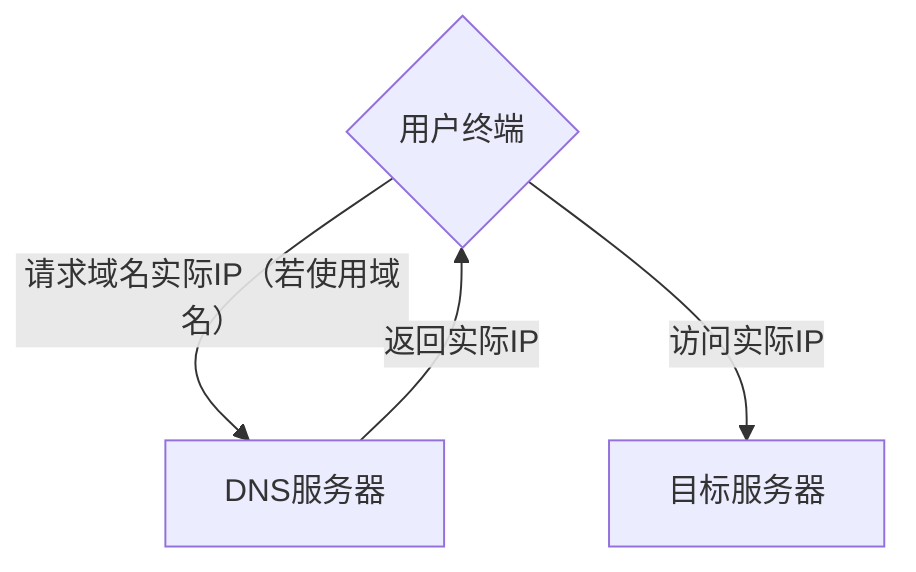
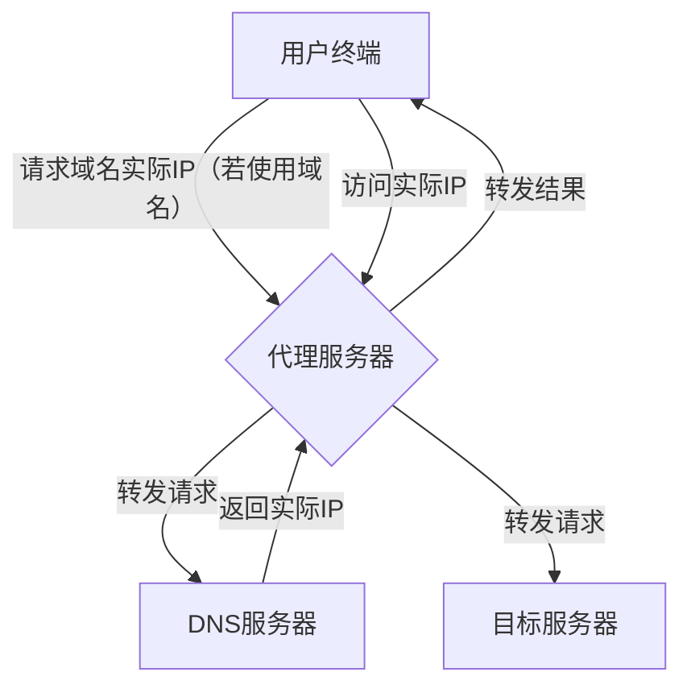
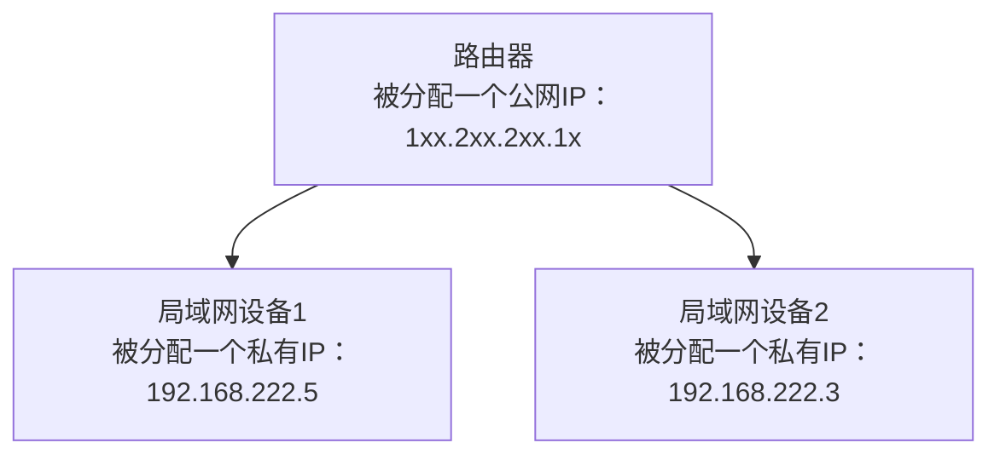

## 岚的声明
<font size=4>

本文为**岚**的**折腾日记**，它只是因为我**想**而写下的，**不具备**权威性，我也**无法**保证正确，**仅供参考**

***本文仅作经验分享，无任何不良引导，所有内容的最终解释权归我（笔者）所有***

***读者对所有内容的实践/理解均属于读者个人行为，本文笔者不会也不应负任何责任***

</font>

```
经验之谈，无有权威；思辨一二，方得自知
```

## 网络流量
### 请求
下图简单描述了用户终端通过网络访问目标服务器的过程



当请求一个域名时，终端会首先向**DNS服务器**请求该域名对应地址，DNS服务器会将查询的结果返回终端，然后终端才会进入**实际IP请求**；而当请求实际IP，会直接尝试与该IP建立连接

其中，每当两个端点**建立连接时**，都会进行**握手**——被请求端通过回复请求端信息告诉它：“我连上你了，可以开始正式传输了。”随后请求端才会将**真正的请求**发送给被请求端，并接收返回的数据

那么，从上面的描述我们可以知道，请求双方是互相知道对方的 **“地址”** 的，这样才能互相通信，也因此：**你终端的每一次请求都会暴露当前IP地址**

### 网络代理
那么，有没有什么办法既能够成功访问目标服务器，同时还**不暴露实际IP**的方法呢？

答案是网络代理，下图简单描述了**正向代理**的作用



可以看到用户终端的**所有网络流量**均由代理服务器进行**中转**，也就是说：**你终端的IP仅会在与代理服务器通信时暴露，其余通信阶段仅会暴露代理服务器的地址**

值得一提的是，代理协议众多，常见的有**HTTP代理**（解析客户端发起的HTTP请求，直接代为请求目标资源并返回）、**SOCKS5代理**（建立一个通用的数据传输隧道，支持TCP、UDP及各种应用层协议）以及更底层的VPN隧道。**VPN**通常在操作系统层面接管所有流量，而浏览器或应用级别的代理则更为灵活，但可能面临UDP流量不支持或DNS泄露——域名查询可能直连泄露真实IP——等问题

非用户本人架设的代理服务器一般具有如下**风险**：
- **数据风险**：使用代理相当于允许一个第三方对连接进行**劫持**，代理服务器能够得到用户端/服务端发出的**所有数据包**。若传输未加密（例如HTTP），代理服务器可明文读取所有内容；而当使用加密连接（例如HTTPS）时，代理虽无法解密内容，但仍能获知你访问的域名及连接时长、流量特征等**元数据**
- **地区问题**：代理服务器会让服务端将用户的请求位置视为**代理服务器所在地**，这可能导致一些地区问题（如审查、法律、个性化等）
- **安全风险**：对于非用户本人架设的代理服务器，其本身的安全性是**完全的未知数**
- **仿冒风险**：代理服务器发出的数据包，用户端与服务端均会**接受并采用**，若数据包遭到了修改，则需要依赖是否存在相关的**验证阶段**来保证安全

### 网络防火墙
网络防火墙本质上是一套**规则集合**，用于控制哪些连接能够正常通过，哪些连接应该被禁止/拦截，以达到**控制网络流量**、保障连接安全的目的

#### The Great Firewall
防火长城是网络防火墙概念的极致实现，它是一个大型防火墙架构，是国家级的网络防御实现

### 局域网、NAT
局域网（LAN）指的是一定范围内的网络终端组成的**网络集群**，在局域网中的终端**相互访问**，只需要具有该局域网中的唯一IP即可建立连接，即使这个IP和其他网络中存在的IP冲突

不严谨地说，只要两个终端能够互相访问，我们就可以说它们处于同一个局域网中，那么当我们把这个概念进一步拓展，会诞生什么呢？

针对**IPV4地址不足**的问题，网络地址转换（NAT）应运而生，它正是利用了上面提到的一些概念，实现将一个公网IPV4地址**复用**给数个局域网设备使用——路由器将内部设备的私有IP（如192.168.x.x）及端口**映射**为自身的公网IP及随机端口，维护一张转换表，并将这些局域网地址分给处于同该局域网中的终端

但是这样只是解决了IPV4地址数量的问题，既然这些终端用的是局域网地址，那么局域网外的终端如何和他们建立连接呢？很明显，上文提到的代理服务器是个不错的选择，我们只需要架设一个使用实际IPV4地址的代理服务器并集成，让它转发范围内局域网地址的流量就行了（NAT路由的确具有代理服务器的概念，但它的构成更为复杂）



但在没有代理的情况下，外部发起的连接**无法穿透NAT**，因为路由器不知道这个传入的数据包该发给内网的哪台设备，这就是**P2P连接困难**的原因。为了解决这个问题，衍生出了**NAT穿透技术**（如UDP打洞、STUN协议），它们大多通过一个**中间服务器**协助两端互相发现并建立直连

在日常的家庭网络中，上述的NAT通常进行了**数次**，从运营商架设的CGNAT服务器局域网，再到各个分信箱局域网，一直到你家的路由器局域网

而这种NAT大内网带来了诸多不便，譬如最常见的：一旦处于局域网外，就无法主动访问局域网终端。为了彻底解决IPV4地址不足的问题，新的IP协议——IPV6诞生了

## IP协议
IP地址是互联网世界的 **“门牌号”** ，就像现实中的门牌号一样，IP地址也有它的 **“规范”** ——IP协议（Internet Protocol），它规定了一系列特定的规则，主要是：IP编址、分组封装、分组转发

目前使用中的IP协议共有两种：**IPV4**和**IPV6**，前者使用**32位**地址长度，后者使用**128位**地址长度，地址长度越长，可用的IP地址就越多，IPV6作为IPV4的替代品，它的地址长度达到了天文数字级别：`2^128`，大约是IPV4数量`2^32`的`7.9*10^28`倍，这使得“就算给地球上每一粒沙子绑定IPV6地址也毫无压力”

但IPV6也带来了一个与公众息息相关的改变：传统IPV4的严重NAT堪比Tor网络，在严重NAT下访问一台服务器，它能拿到的是**运营商的CGNAT服务器**IP地址，而在IPV6时代，每台设备**都有机会**分到一个**属于自己**的IPV6地址，也就是俗称的 **“公网IP”** ，现在访问一台服务器，它能直接拿到你的IPV6地址，不信的话，我们来做个小实验，WIN+X+I打开你的终端，不管是cmd还是Powershell（如果你使用Linux，那怎么看IP应该不用教了吧），执行下面的命令：

```powershell
ipconfig /all
```

记下`Temporary IPv6 Address`和`IPv6 Address`（如果没有或是fe80::开头，则说明你没有拿到**可用的**全局路由IPV6地址），然后访问[BrowserLeaks](https://browserleaks.com/ip)（这个网站我们在浏览器篇还会用到），你应该能看到**IPV6 Address**一栏显示你刚记下的地址其中之一

因此，你的IP已经从无所谓变成需要卫生了。不过不用紧张或者过于担心，现代操作系统/路由器拥有**完善的防火墙**，你只要不乱动或者使用可疑程序还是没问题的

### IP 地址与地理位置
首先说说你可能比较关心的问题：既然服务器能拿到我的IP地址，那它是不是可以直接用来**定位**我了？答案是，可以，但不完全可以。IP 本身**并不**直接包含经纬度，而是依赖注册信息、运营商分配、路由数据等**间接判断**，一般而言，能够定位到省/州、城市已是极限

### Tor Project
前面我们提到，代理服务器方案能够成功访问目标服务器，同时还不暴露实际IP，那么有没有更好的方案隐藏网络流量特征呢？

答案是，Tor Project

Tor网络使用**大量分散的节点**，当用户访问时，会去随机连接中继节点，并**重复多次**，然后连接目标IP，因此想要对访问溯源，必须破解这一路上的所有中继节点，这使得**没有任何单点同时知道通信两端**：入口知道你是谁、不知道你访问谁；出口知道目的地、不知道你是谁；中间只知道下一跳，但**无法防御同时控制入口和出口做流量关联**

> Tor始于美国军方，又被美国政府持续资助，其设计是分布式且开源的；使用 Tor 访问普通网站可能速度较慢且会标记你的流量为“特殊”，潜在风险包括出口节点**监控**，**仅作原理解释，对其使用风险不做保证**

#### Dark Web
你可能在网络上看到各种将暗网吹的神乎其神的信息，在这里借着Tor这个话题，我想给“神秘暗网”这个外衣去去魅

大众概念中的“暗网”，一般指的是两个部分的集合：**深网**和**Tor网络**。深网指的是那些**无法被常规方法检索**的网络，例如某网盘的云储存、某加密聊天软件的聊天通信，就是深网的一部分；而**Tor网络**特指那些需要使用Tor Project才可正常访问的 **.onion域名** 网站。

所谓Tor网络实际上没有那么**神秘**，**很多网站**都有自己的.onion版本，比如DuckDuckGo、Reddit，对于**隐私极度敏感**的群体会选择Tor网络保护隐私，但也因为其极强的**隐私性**与**无监管**，这里也充斥着大量的**利益交换**，**非法交易**等等

## 待续